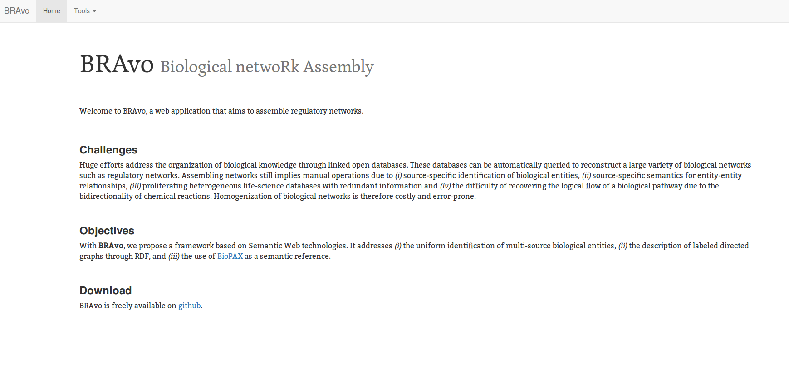

# BRAvo : Biological netwoRk Assembly 

## Synopsis
BRAvo is a web interface that aims to assemble regulatory networks. It is available at http://vm0131.france-bioinformatique.fr/

## Motivations
Huge efforts address the organization of biological knowledge through linked open databases. These databases can be automatically queried to reconstruct a large variety of biological networks such as regulatory networks. Assembling networks still implies manual operations due to _(i)_ source-specific identification of biological entities, _(ii)_ source-specific semantics for entity-entity relationships, _(iii)_ proliferating heterogeneous life-science databases with redundant information and _(iv)_ the difficulty of recovering the logical flow of a biological pathway due to the bidirectionality of chemical reactions. Homogenization of biological networks is therefore costly and error-prone. 

**With BRAvo, we propose a framework based on Semantic Web technologies. It addresses _(i)_ the uniform identification of multi-source biological entities, _(ii)_ the description of labeled directed graphs through RDF, and _(iii)_ the use of [BioPAX](http://www.biopax.org/) as a semantic reference.**

## Requirements
- git
- maven
- java8

## Installation
Clone the repository

    git clone https://github.com/symetric-group/bionets-demo.git
    
Build package with maven :

    mvn install -Dmaven.test.skip=true
    
Run the web appliation 

    java -jar target/linked-bionet-1.0-SNAPSHOT-datahub-launcher.jar
   
See on http://localhost:8091/

## Maven dependencies 
This software is built on top of the following Java dependencies : 
 - JENA (https://jena.apache.org)
 - GSON (https://github.com/google/gson)
 - Jersey (https://jersey.java.net)
 - Log4J (https://logging.apache.org/log4j/2.0/)
 - Commons CLI (https://commons.apache.org/proper/commons-cli/)
 - Commons Lang (https://commons.apache.org/proper/commons-lang/)

## License
MIT
